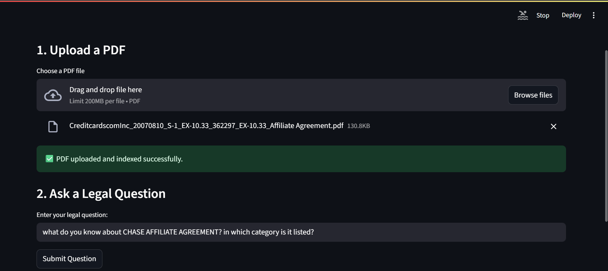
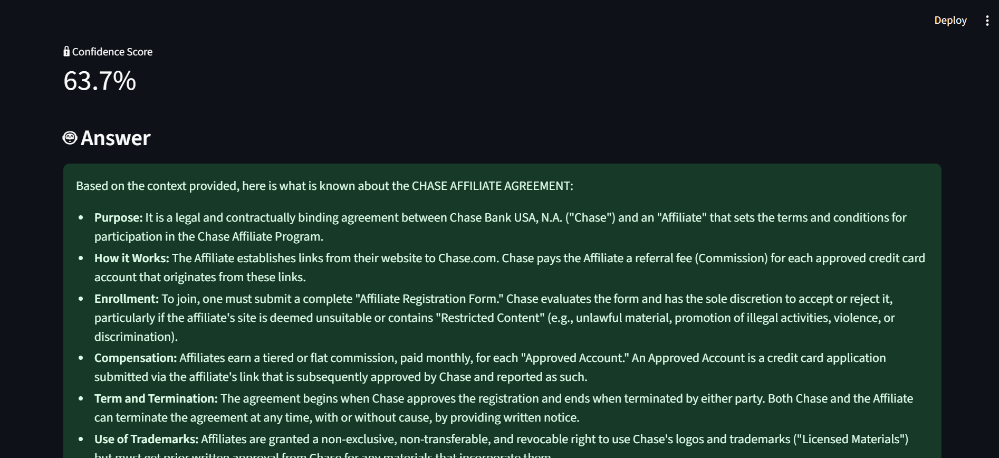
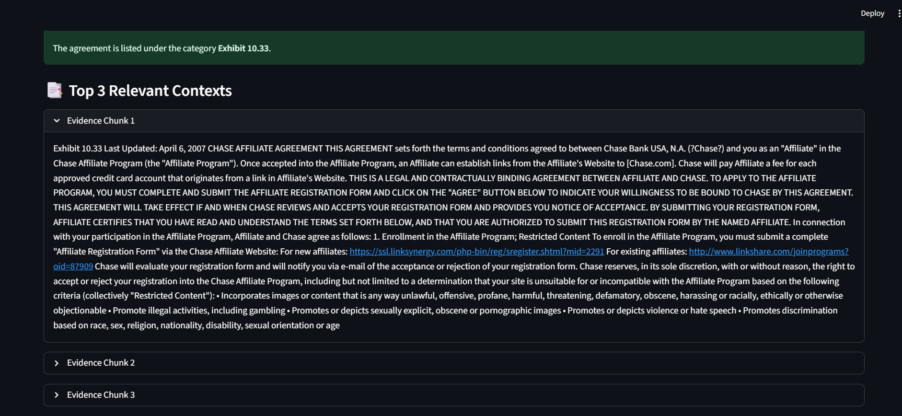

# 🧠 Legal_QnA_RAG_LLM

A Retrieval-Augmented Generation (RAG) system designed for **legal document question-answering** using **FAISS**, **Gemini LLM**, and the **CUAD (Contract Understanding Atticus Dataset)**. It supports runtime ingestion of PDF contracts and allows querying in realtime.

---
## 🖼️ App Preview

live snapshot of the Legal Q&A app in action:





## 🚀 Features

- 📄 Upload **legal contracts (PDF)** and ask natural language questions
- 🧠 Uses **RAG architecture** with FAISS-based semantic retrieval
- 💬 Answers generated using **Google Gemini (Pro 2.5) LLM**
- 🧾 Uses **CUAD** dataset to prebuild a legal clause knowledge base
- ⚡ FastAPI backend with **Streamlit UI**
- 📦 Fully containerized using **Docker**
- 📊 Evaluated for confidence score and latency (see below)

---

## 📁 Dataset

### CUAD (Contract Understanding Atticus Dataset)
- [CUAD Dataset on HuggingFace](https://huggingface.co/datasets/TheAtticusProject/cuad)
- 13,000+ expert-annotated legal clauses across 41 labels
- Used `.txt` files in `full_contracts_txt/` directory for augmentation
- FAISS index built at startup for persistent recall

---

## 🛠️ Tech Stack

| Layer            | Tool                  |
|------------------|------------------------|
| Backend API      | FastAPI + Uvicorn      |
| Embeddings       | SentenceTransformers (`all-MiniLM-L6-v2`) |
| Vector DB        | FAISS                  |
| LLM              | Gemini 2.5 Pro         |
| PDF Parsing      | PyMuPDF (`fitz`)       |
| Frontend         | Streamlit              |
| Deployment       | Docker + Render        |
| Evaluation       | Custom script (`eval.py`) |

---

## 🧪 Evaluation Report

| Metric             | Value                |
|--------------------|----------------------|
| 📈 Average Confidence Score | **61.68%**         |
| ⏱️ Average Latency          | **11.78 seconds**  |

> Evaluation performed over 20 legal queries using both CUAD and uploaded contracts.

---

## 📦 Setup & Run

### 🔧 1. Clone the repo

```bash
git clone https://github.com/yourusername/Legal_QnA_RAG_LLM.git
cd Legal_QnA_RAG_LLM
````

### 📁 2. Create `.env`

Create a `.env` file in the root with:

```dotenv
GEMINI_API_KEY=your_google_gemini_api_key
```

### 🐍 3. Install dependencies

```bash
pip install -r requirements.txt
```

### 🧠 4. Run backend

```bash
uvicorn app:app --reload
```

### 🌐 5. Run Streamlit UI (optional)

```bash
streamlit run app_streamlit.py
```

### 🧪 6. Run Evaluation

```bash
python eval.py
```

---

## 🐳 Docker Setup

### 🔨 Build image

```bash
docker build -t rag-legal-qa .
```

### 🚀 Run container

```bash
docker run -p 8000:8000 rag-legal-qa
```

---

## 🤖 API Reference

### `POST /ask`

Ask a legal question.

**Form Data:**

* `question`: your question
* `session_id`: session identifier (string)

### `POST /upload_pdf`

Upload a PDF contract for QA context.

**Form Data:**

* `file`: PDF file

---

## 🚀 Deployment

This project is deployed on [Render](https://render.com).

---

## 💡 Future Improvements

* Add answer highlighting in source chunks
* Integrate document OCR (for scanned contracts)
* Role-based access or chat history
* Evaluation against ground-truth answers

---

## 📄 License

MIT License © 2025 Dhananjay Sharma

---

## 🙌 Acknowledgements

* [Google Generative AI](https://ai.google.dev/)
* [FAISS by Facebook AI](https://github.com/facebookresearch/faiss)
* [CUAD Dataset](https://huggingface.co/datasets/TheAtticusProject/cuad)

```
